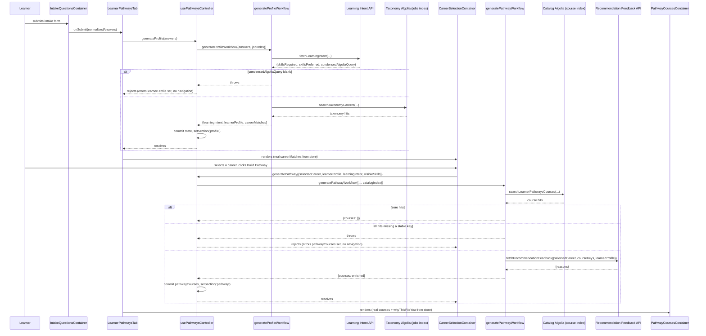
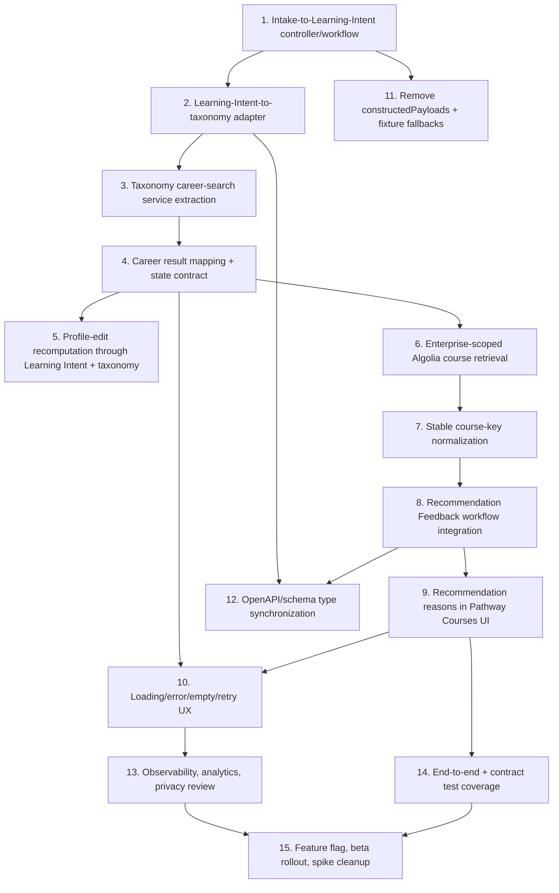

# Learning Intent -> Taxonomy -> Recommendations: Productionization Plan

> Status: draft, written against an uncommitted integration spike
> (`hu/ent-12007-learning-intent-integration-spike`). Not committed — this
> document is part of the spike's working tree, for review purposes only.

## 1. Executive summary

This spike wires the full learner-facing flow through the *real* learner-pathways
UI and Zustand store — not a parallel debug page:

```
Intake form -> Learning Intent API -> taxonomy career search -> Career Selection UI
  -> learner selects a career -> Build Pathway -> catalog course search
  -> Recommendation Feedback API -> Pathway Courses UI (with personalized reasons)
```

**What it validates:**
- Enterprise Access's Learning Intent and Recommendation Feedback endpoints work
  end-to-end from the real UI, including two real backend-contract bugs found and
  fixed in earlier sessions (trailing-slash 405, array-vs-string request fields).
- A narrow, learner-pathways-local taxonomy adapter (not the full `ai-pathways`
  `XpertIntent`/tiering pipeline) can drive a real Algolia jobs-index search from
  Learning Intent's output and populate the real Career Selection UI.
- A real, secured Algolia catalog search (via the same `useAlgoliaSearch` hook
  production search already uses) can be driven by the learner's *selected*
  career, and its results can be enriched with Recommendation Feedback reasons
  and rendered in the real Pathway Courses table.
- The controller/workflow/service layering established in earlier sessions
  extends cleanly to a second, more complex workflow (`generatePathwayWorkflow`)
  without needing new architectural primitives (no new store, no React Query
  orchestration, no context providers).

**What is production-shaped (safe to build on):**
- The controller/workflow/service layering and the explicit-input contracts
  (`generateProfile(answers)`, `generatePathway(input)`).
- Using `useAlgoliaSearch()` — the same secured hook production search uses —
  for the catalog course search, instead of a standalone unsecured client.
- The course-key strictness policy (drop malformed hits, only fail if none are
  usable) and the key-based (not array-position-based) reasons join.
- The state shape additions (`learningIntent`, reusing existing `CareerMatch`/
  `PathwayCourse`/`LearnerProfile` fields as-is).

**What is temporary (must not ship as-is):** see §14 for the full table.
Headlines: no enterprise-catalog-UUID scoping on the course search yet; no real
match-percentage/labor-market-trend computation; several `LearnerProfile` fields
are empty placeholders because intake doesn't collect them yet; the taxonomy
adapter is intentionally narrower than `ai-pathways`' full pipeline (no rules-first
skill tiering, alias mapping, or facet-snapshot grounding).

**Recommended production direction:** land the tickets in §15 roughly in the
order listed — service/adapter work first (already mostly done here), then the
controller/state contract, then the two UI integration tickets, then the
cross-cutting UX/observability/rollout work last. See §15's dependency diagram.

## 2. End-to-end sequence



Failure boundaries are drawn explicitly in the diagram: Learning Intent failure
never reaches taxonomy search; taxonomy failure never navigates to the profile
section; Algolia course-search failure never reaches Recommendation Feedback;
Recommendation Feedback failure never navigates to the pathway section. In every
failure case, the previous screen/state remains visible and the relevant action
(submit / Build Pathway) becomes clickable again once loading clears.

## 3. Component and ownership map

| Component/file | Current responsibility | Responsibility after productionization | Dependencies | State read/written | HTTP/Algolia awareness |
|---|---|---|---|---|---|
| `LearnerPathwaysTab.tsx` | Section routing; owns both `useAlgoliaSearch` calls; passes indexes to children | Same, but the two `useAlgoliaSearch` calls should likely move behind a feature-flag-gated boundary with a scoped `<Suspense>` fallback (see §12) | `useAlgoliaSearch`, `usePathwaysController` | Reads `section`; writes none directly | Knows Algolia exists (via the hook), not HTTP |
| `IntakeQuestionsContainer.tsx` | Collect/validate/normalize intake answers, call `onSubmit` | Unchanged | react-hook-form, Zustand (onboarding answers only) | Writes `onboarding.answers` | Neither |
| `usePathwaysController.ts` | Owns loading/error/state-commits/navigation for both `generateProfile` and `generatePathway`; guards null Algolia indexes | Same; add richer error taxonomy (see §7) and likely split into two hooks if it keeps growing | `generateProfileWorkflow`, `generatePathwayWorkflow`, Zustand | Writes almost everything except onboarding answers and constructedPayloads | Knows workflows exist, not HTTP/Algolia directly |
| `generateProfileWorkflow.ts` | Learning Intent -> taxonomy search -> LearnerProfile/CareerMatch[] mapping | Same, plus real career/taxonomy skill-tiering once product wants better ranking | `fetchLearningIntent`, `searchTaxonomyCareers`, `mappers.ts` | None (pure) | Calls services, doesn't construct clients |
| `generatePathwayWorkflow.ts` | Course search -> course-key guard -> Recommendation Feedback -> merge | Same, plus real enterprise catalog scoping | `searchLearnerPathwaysCourses`, `fetchRecommendationFeedback`, `mappers.ts` | None (pure) | Same as above |
| `CareerSelectionContainer.tsx` | Renders profile/career UI; derives `selectedCareer`; calls `submitGoalSummary`/`buildPathway` | Same; profile-edit (`submitGoalSummary`) reuse of Learning Intent is still a real, separate ticket (§15 #5) | `usePathwaysController`, Zustand | Reads learnerProfile/careerMatches/selectedCareerId/learningIntent; writes selectedCareerId | Neither directly |
| `PathwayCoursesContainer.tsx` / `PathwayCoursesDataTable.tsx` | Render courses + `whyThisFitsYou` | Unchanged — already generic | Zustand (`pathwayCourses`) | Reads only | Neither |
| `xpert.ts` | Transport-only: `fetchLearningIntent`, `fetchRecommendationFeedback` | Unchanged | `getAuthenticatedHttpClient` | None | HTTP only |
| `services/taxonomyCareerSearch.ts` | Plain Algolia search + hit mapper for the jobs index | Same; may need real facet/filter support if product wants industry/job-source filtering | Injected `SearchIndex` | None | Algolia only |
| `services/catalogCourseSearch.ts` | Plain Algolia search + hit mapper for the catalog index | Same; needs enterprise-catalog-UUID scoping added (§15 #6) | Injected `SearchIndex` | None | Algolia only |
| `state/pathwaysStore.ts` | Synchronous setters only, no orchestration | Unchanged in shape; `constructedPayloads` removal is tracked separately (§15 #11) | Zustand | N/A | Neither |

## 4. Contract map

| Boundary | Shape | Status |
|---|---|---|
| Intake form -> profile controller | `OnboardingAnswers` (`motivation, goal, background, industry`) | Authoritative |
| Profile controller -> profile workflow | `{ answers: OnboardingAnswers, jobIndex: SearchIndex }` | Authoritative (jobIndex spike-injected; production may source it differently, see §6) |
| Profile workflow -> Learning Intent service | `{ selectedGoals: string, freeText: string, knownContext: string }` (all plain strings, confirmed against the real DRF serializer) | Authoritative |
| Learning Intent response -> taxonomy input | `{ query: condensedAlgoliaQuery, skillsRequired, skillsPreferred }` | Authoritative for the spike's narrow adapter; **derived** — a production taxonomy adapter may want more signals (industry, job sources) that Learning Intent doesn't currently return |
| Taxonomy hit -> `CareerMatch` | `id, title, skillsToDevelop` | Authoritative fields; `matchPercentage`/`laborMarketTrend` are **spike-only omitted** (see §6, §14) — still requires product confirmation on real ranking |
| Selected career (UI) -> pathway workflow | `{ selectedCareer: CareerMatch, learnerProfile, learningIntent, visibleSkills, catalogIndex }` | Authoritative |
| Selected career -> course Algolia input | `query: selectedCareer.title`, `optionalSkills: dedupe(visibleSkills + learningIntent skills)` | Authoritative for the spike; **still requires product confirmation** on whether title-as-query is the right primary signal long-term |
| Course hit -> `PathwayCourse` | `id: objectID, courseKey: hit.key (no fallback), title, provider, level, status` | Authoritative; `length`/`marketingUrl`/`shortDescription`/`imageUrl` are **optional, still requires product confirmation** on which fields the UI should show |
| Pathway workflow -> Recommendation Feedback service | `{ selectedCareer: title, courseKeys: string[], learnerProfile: minimal projection }` | Authoritative shape; `selectedCareer` as the human-readable title is **still requires product/backend confirmation** (documented in code comments since an earlier session) |
| Recommendation Feedback reasons -> enriched course | `whyThisFitsYou = reasons[course.courseKey]`, joined by key | Authoritative |
| Workflow results -> Zustand | `learningIntent, learnerProfile, careerMatches, pathwayCourses` all committed by the controller | Authoritative |

## 5. State model

- **Persist in Zustand:** `learningIntent`, `learnerProfile`, `careerMatches`,
  `selectedCareerId`, `pathwayCourses`, `loading`, `errors`, `experienceStatus`,
  `section` — all already there or added by this spike. These represent
  cross-screen state that must survive navigation between onboarding/profile/
  pathway sections.
- **Workflow-local (not persisted):** the taxonomy/course search inputs
  themselves (`TaxonomySearchInput`, `optionalSkills`), the raw Algolia hits, and
  the intermediate `RecommendationFeedback` request payload. None of these need
  to outlive a single workflow call.
- **`learningIntent` should be stored** — confirmed necessary, since Stage 2
  (course search + Recommendation Feedback) reuses its `skillsRequired`/
  `skillsPreferred`.
- **Minimum selected-career contract:** `CareerMatch` (`id`, `title`,
  `skillsToDevelop`) is sufficient — no need to retain the full raw taxonomy hit.
- **Why raw provider hits are NOT retained:** the ticket for this spike
  explicitly warned against storing `raw: unknown`/`any` payloads in Zustand;
  every mapper here produces a narrow, typed shape instead. This trades away
  some future flexibility (e.g., re-deriving a field nobody thought to map yet)
  for a much smaller, more inspectable state surface. If a real need for raw
  hit data emerges, prefer widening the specific mapped type over reintroducing
  a raw blob.
- **`constructedPayloads` removal:** intentionally deferred (§15 #11). It's
  fully unused by the new `generateProfile`/`generatePathway` call sites now,
  but `submitGoalSummary` (profile-edit) still writes to it, and removing it
  requires deciding what (if anything) profile-edit's future Learning-Intent
  reuse should use instead — a decision for that ticket, not this one.
- **Navigation/experience-status transitions**, confirmed working: `not_started`
  → (`onboarding_in_progress` on `startOnboarding`) → `profile_ready` (on
  `generateProfile` success) → `pathway_ready` (on `generatePathway` success).
  Both `profile_ready`/`pathway_ready` transitions and their matching `section`
  changes (`profile`/`pathway`) are now owned by the controller, not the
  components that trigger them.

## 6. Algolia architecture

### Taxonomy search

- **Index used:** `config.ALGOLIA_INDEX_NAME_JOBS`, via `useAlgoliaSearch(indexName)`
  called from `LearnerPathwaysTab` (the single top-level owner).
- **Client initialization:** production's `useAlgoliaSearch` hook — the same
  BFF-secured flow `SimilarJobs.jsx`/`SearchJobRole.jsx` already use for this
  index. `ALGOLIA_INDEX_NAME_JOBS` is explicitly excluded from the *secured* key
  path in `useAlgoliaSearch.ts` (`unsupportedSecuredAlgoliaIndices`), so this
  falls back to the plain `ALGOLIA_SEARCH_API_KEY` regardless — there's no
  further security work needed here beyond what's already true today.
- **Query and filters:** `query = learningIntent.condensedAlgoliaQuery`,
  `optionalFilters` built from `skillsRequired`/`skillsPreferred` as
  `skills.name:"<skill>"` (soft ranking boosts only, no hard facet filters).
  `hitsPerPage: 10`.
- **Result mapping:** `id`, `title`, `skillsToDevelop` only.
  `matchPercentage`/`laborMarketTrend` intentionally omitted rather than faked.
- **Relation to `ai-pathways`:** the query-building *principle* (condensed
  query + optional skill filters) is reused; the full `XpertIntent`/
  `catalogTranslationRules`/`skillTiering`/alias-map machinery is **not** —
  our `LearningIntentResponse` doesn't carry the fields that pipeline needs
  (`roles`, `industries`, `jobSources`, `learnerLevel`, `timeCommitment`,
  `excludeTags`), and padding them with placeholders would be worse than not
  having them.

### Course search

- **Index used:** `config.ALGOLIA_INDEX_NAME_V2 || config.ALGOLIA_INDEX_NAME`,
  via the same `useAlgoliaSearch` hook — a real upgrade over an earlier spike
  iteration that built its own unsecured `algoliasearch(...)` client directly.
- **Enterprise catalog scoping:** **not yet implemented.** Production search
  scopes results via `enterprise_catalog_query_uuids` (from
  `useAlgoliaSearch`'s own `catalogUuidsToCatalogQueryUuids`), which this spike
  doesn't apply. This is the single largest functional gap versus production
  search and is tracked as its own ticket (§15 #6) rather than solved here.
- **Secured-key behavior:** inherited for free from `useAlgoliaSearch` — no
  extra work.
- **Filters:** `content_type:course` and `metadata_language:en` (hard
  `facetFilters`), plus soft `optionalFilters` from `dedupe(visibleSkills +
  learningIntent.skillsRequired + learningIntent.skillsPreferred)`, capped at 8.
- **Initial spike query:** `selectedCareer.title` as the primary query string.
  Whether this is the right long-term signal (versus, say, a career-to-skills
  translation similar to `ai-pathways`' `catalogTranslationRules`) needs product
  input — flagged in §4.
- **Recommended production retrieval strategy:** start from this simple
  single-shot query; only add `ai-pathways`'s multi-step retrieval ladder
  (broad/boosted/fallback/scope-only) if real result quality demonstrably needs
  it. Reaching for the full ladder immediately would be over-engineering for
  the demonstrated need.
- **Stable course-key source:** `hit.key` (the catalog course key), confirmed
  to exist on real Algolia course records per `ai-pathways`' own
  `CourseRetrievalHit` type — **not independently re-verified against a live
  index in this environment** (no reachable devstack); this needs a real
  manual check before shipping (see §11).
- **Zero-result behavior:** returns `{ courses: [] }`, a valid success, no
  Recommendation Feedback call (the backend's `course_keys` serializer field
  has `allow_empty=False`, so an empty-array call would 400 anyway).

## 7. Error and recovery model

| Stage | Error owner | User-facing message | Retry behavior | Prior state visible? | Navigation? | Logging |
|---|---|---|---|---|---|---|
| Learning Intent | `usePathwaysController.generateProfile` | `errors.learnerProfile` (raw `Error.message` from the service/workflow) | Learner can resubmit the intake form (no auto-retry) | Yes — intake answers remain in the form | Stays on onboarding | None added yet — see §10 |
| Taxonomy retrieval | Same (`errors.learnerProfile`, same try/catch) | Same field, same message pass-through | Same | Yes | Stays on onboarding | None added yet |
| Course retrieval | `usePathwaysController.generatePathway` | `errors.pathwayCourses` | Learner can click Build Pathway again | Yes — profile/career selection remains visible | Stays on profile | None added yet |
| Recommendation Feedback | Same (`errors.pathwayCourses`) | Same field | Same | Yes | Stays on profile | `logError` per dropped malformed course hit (only case with any logging today) |
| State mapping (mappers.ts) | N/A — pure functions, no failure mode of their own | N/A | N/A | N/A | N/A | N/A |

Not yet done, worth a dedicated pass: distinguishing user-facing messages by
failure type (network vs. validation vs. "Algolia not configured" vs. "no
usable course keys") rather than surfacing the raw `Error.message` from
whatever layer threw. Today's messages are developer-legible but not
necessarily learner-friendly (e.g., "All course results are missing a stable
catalog key; cannot request Recommendation Feedback." is accurate but not
something a learner should ever see verbatim).

## 8. Security and privacy

- **Authenticated Enterprise Access calls:** unchanged from earlier sessions —
  `fetchLearningIntent`/`fetchRecommendationFeedback` both use
  `getAuthenticatedHttpClient()`.
- **Algolia secured keys:** the course search now goes through
  `useAlgoliaSearch`'s BFF-secured flow (a real improvement this session). The
  taxonomy/jobs index is exempted from the secured-key path by production's own
  existing config (`unsupportedSecuredAlgoliaIndices`), so this spike doesn't
  change that index's security posture either way.
- **Enterprise catalog scoping:** not yet applied to the course search — see
  §6, §14, §15 #6. This means, as currently implemented, the course search can
  surface catalog content the learner's enterprise agreement may not actually
  grant access to. **This must be fixed before any real rollout.**
- **Learner-profile data minimization:** `buildRecommendationProfile` sends
  only `careerGoal, targetIndustry, background, motivation, skillsRequired,
  skillsPreferred, selectedCareerTitle, selectedCareerSkills` — explicitly not
  the whole Zustand store, not loading/error/navigation state, not raw Algolia
  clients.
- **Sensitive payload logging:** none of the new code logs full learner text,
  JWTs, or auth headers. The one `logError` call in `generatePathwayWorkflow`
  logs only a course's local `id`/`title` (public catalog metadata) when
  dropping a malformed hit.
- **Prompt/model data ownership:** unchanged — Enterprise Access still owns
  prompt selection, construction, execution, and response parsing; the frontend
  never talks to Xpert directly (confirmed via `git grep` — no `ai-pathways`
  or Xpert-client imports exist in the changed files).

## 9. Performance and cost

- **Number/ordering of external calls:** per full flow, 2 Xpert-backed calls
  (Learning Intent, Recommendation Feedback) and 2 Algolia calls (taxonomy,
  catalog) — always sequential, never parallel, since each depends on the
  previous stage's output (Learning Intent's query feeds taxonomy search;
  the selected career feeds course search; course search's keys feed
  Recommendation Feedback).
- **Why calls can't run in parallel:** genuinely can't — this isn't a
  performance shortcut, it's a real data dependency chain.
- **Xpert cost implications:** two Xpert-backed calls per "generate profile"
  action and one per "build pathway" action; no batching, no caching. Cost
  scales linearly with learner actions, which is expected for AI-backed
  personalization but worth budgeting for at scale (see §10 for the metrics
  that would make this visible).
- **Duplicate submission prevention:** confirmed working via the existing
  `loading.learnerProfile`/`loading.pathwayCourses` flags disabling the
  relevant action-bar buttons — verified in both `LearnerPathwaysTab.test.tsx`
  and `CareerSelectionContainer.test.tsx`.
- **Timeout expectations:** not explicitly configured anywhere in this chain —
  relies on whatever default timeout `getAuthenticatedHttpClient()`/Algolia's
  JS client use. Worth an explicit decision once real latency data exists.
- **No automatic retry for AI calls:** confirmed — neither workflow adds retry
  logic; a failure surfaces immediately and requires an explicit learner action
  to retry.
- **Algolia result limits:** taxonomy search `hitsPerPage: 10`; course search
  `hitsPerPage: 5` (both small, intentional for spike inspectability — may need
  tuning based on real relevance/coverage data).
- **Caching boundaries:** none introduced. `useAlgoliaSearch`'s underlying BFF
  query is cached by React Query per its existing configuration; the two new
  workflows and their Algolia adapters have no caching of their own, by design
  (ticket explicitly said not to introduce new React Query orchestration for
  this work).
- **Where React Query should/shouldn't be used:** should — for the existing
  `useAlgoliaSearch`/BFF layer (already the case). Should not — for the
  workflow-level orchestration itself; the controller/workflow pattern here is
  intentionally plain `async`/`await`, not a query/mutation.

## 10. Observability

None of the following exist yet in this spike — all recommended for a
production ticket (see §15 #13):
- Frontend workflow-stage logging (start/success/failure per stage: Learning
  Intent, taxonomy, course search, Recommendation Feedback), likely via the
  existing `logError`/`logInfo` from `@edx/frontend-platform/logging`.
- Request correlation — some way to tie the 4 sequential calls in one "generate
  profile" or "build pathway" action together (e.g., a client-generated
  correlation ID passed through, or relying on backend-side request IDs).
- Per-endpoint status metrics (success/4xx/5xx rates) for both new Enterprise
  Access endpoints.
- Taxonomy/course result-count metrics, and specifically an **empty-result
  rate** metric (how often zero careers or zero courses come back — a strong
  signal of query-quality problems).
- Recommendation Feedback **reason-coverage** metric (what fraction of
  requested course keys come back with a real `reasons` entry vs. missing).
- Latency-by-stage (four numbers per full flow, not just one aggregate).
- Explicit avoidance of logging learner free-text (motivation/background/goal)
  anywhere in the above — only structural/count metadata should ever be logged.

## 11. Testing strategy

**What exists after this spike** (all passing): unit tests for both new/renamed
Algolia adapters (`taxonomyCareerSearch.test.ts`, `catalogCourseSearch.test.ts`),
pure-mapper tests (`mappers.test.ts`), both workflows' full sequencing/failure/
guard behavior (`workflows.test.ts`, 24 cases), controller state-commit/
navigation/null-guard behavior (`usePathwaysController.test.tsx`, 13 cases),
and component-integration tests proving the *real* UI renders real data end to
end (`LearnerPathwaysTab.test.tsx`, `CareerSelectionContainer.test.tsx`).

**Still needed for production:**
- **Contract tests** against the real Enterprise Access OpenAPI schema once
  it's regenerated to include `learner-pathways/learning-intent` and
  `recommendation-feedback` (neither exists in the checked-in schema as of this
  writing — confirmed in an earlier session).
- **Backend/frontend schema synchronization** — today the frontend's local
  types (`LearningIntentRequest`/`Response`, `RecommendationFeedbackRequest`/
  `Response`) are hand-maintained against the real DRF serializers found by
  reading the `enterprise-access` source directly; this should become generated
  or otherwise automatically checked once the OpenAPI schema catches up.
- **Failure-injection coverage** beyond what unit tests can simulate — e.g., a
  real Algolia outage, a real 500 from Enterprise Access, to confirm the error
  UI actually renders correctly end to end (not just that the mocked promise
  rejects).
- **True end-to-end tests** (e.g., Cypress/Playwright against a real or
  faithfully-mocked backend) — none exist yet; all current coverage is
  component/unit-level with mocked service/Algolia boundaries.
- **Manual verification against a live devstack + configured Algolia indices**
  — **not performed in this environment** (no reachable devstack). This is a
  real, outstanding gap this document cannot close on its own; whoever picks up
  the next ticket should run the manual checks originally requested (single
  request per stage, no trailing slashes, real stable course keys, real
  reason-to-course join) before considering any of this production-ready.

## 12. Accessibility and UX

- **Loading announcements:** the existing action-bar `loading`/`disabled` props
  already drive a visible spinner + disabled state (established pattern, reused
  unchanged for both new actions). No dedicated screen-reader loading
  announcement (e.g., an `aria-live` region) exists yet — worth adding.
- **Disabled actions:** confirmed both submit (intake) and Build Pathway
  buttons disable correctly while their respective workflow is in flight, and
  reject duplicate clicks (tested).
- **Focus behavior after navigation/errors:** not addressed by this spike —
  neither a successful section change nor an error surfacing moves focus
  anywhere explicitly. Worth a pass to ensure focus lands somewhere sensible
  (e.g., the error alert, or the newly-rendered section's heading) for
  screen-reader users.
- **Empty career results:** already handled gracefully by existing
  `CareerMatchesBody` (renders a "no matches, edit goal summary" empty state) —
  no new work needed here, confirmed via exploration.
- **Empty course results:** the workflow returns a valid empty list; the
  Pathway Courses table's empty-state behavior wasn't specifically verified in
  this session (no component changes were needed, but no dedicated empty-state
  UX review happened either) — worth confirming intentionally renders
  something sensible rather than a blank table.
- **Preserving learner input after failure:** confirmed — intake form values
  and profile/career selection state remain visible/intact on any failure in
  this flow, since no code path clears them on error.
- **Reason fallback presentation:** `whyThisFitsYou` can be `undefined` for an
  individual course (missing reason); `WhyThisFitsYouCell` already has a
  pre-existing fallback message for this case (confirmed in an earlier
  session) — no new work needed.

## 13. Rollout and migration

- **Feature flag strategy:** not addressed by this spike (no flag was
  introduced or checked). The existing `FEATURE_ENABLE_AI_LEARNER_PATHWAYS`
  flag (confirmed to exist from earlier exploration) already gates the whole
  learner-pathways tab — production rollout of this specific flow likely wants
  its own sub-flag or staged rollout within that existing gate, rather than a
  new flag from scratch.
- **Internal/beta enablement:** recommend enabling for internal/2U accounts
  first, given the unresolved enterprise-catalog-scoping gap (§6) — external
  learners should not see this flow until that's fixed.
- **Staged enterprise rollout:** gate by enterprise customer, informed by which
  customers have `ALGOLIA_INDEX_NAME_JOBS`/catalog access properly configured.
- **Monitoring gates:** the observability work in §10/§15 #13 should exist
  *before* wide rollout, not after — empty-result and error-rate metrics are the
  minimum needed to know if the flow is working for real customers.
- **Fixture removal:** `CAREER_SELECTION_STUB_MATCHES`/`buildCareerSelectionStubProfile`
  remain in place, used only for the "no data yet" placeholder state (confirmed
  this spike does not fall back to them on a real failure) — full removal is a
  product decision, not purely technical, and isn't blocking.
- **`ai-pathways` prototype relationship:** this spike used it strictly as an
  architectural reference (query-building principles, hit-shape confirmation)
  — no prototype code, direct Xpert calls, or prompt-interceptor state was
  copied. The prototype itself remains untouched and can continue to exist
  independently; there's no hard dependency either direction.
- **Rollback behavior:** since this is all additive to existing components
  (no destructive migrations, no schema changes to existing state fields), a
  rollback is a plain revert — no data migration/backfill concerns.

## 14. Spike shortcuts and production gaps

| Shortcut | Why acceptable for the spike | Production risk | Required remediation | Proposed ticket |
|---|---|---|---|---|
| Course search has no enterprise-catalog-UUID scoping | Proves the workflow/UI wiring without needing the full BFF catalog-UUID plumbing | Learners could see catalog content outside their enterprise's actual entitlement | Add `enterprise_catalog_query_uuids` facet filtering, sourced from `useAlgoliaSearch`'s `catalogUuidsToCatalogQueryUuids` | §15 #6 |
| No real `matchPercentage`/`laborMarketTrend` on careers | `ai-pathways` itself hardcodes a fake `0.95` — omitting is more honest than copying a fake number | None to learners today (UI already hides the badge when absent) — but no real ranking signal exists to build UX around later | Decide a real ranking signal for careers (Algolia relevance rank? backend-computed score?) before promising this in the UI | §15 #3/#15 |
| `LearnerProfile.summary`/`learningStyle`/`weeklyTimeCommitment`/`certificatePreference` are empty strings | Intake doesn't collect them, Learning Intent doesn't return them, and none render in the UI today | None currently visible, but blocks any future UI that wants to show them | Expand intake to collect them, or drop the fields from `LearnerProfile` if never needed | §15 #4 |
| Malformed course hits (missing `key`) are dropped and logged rather than blocking the whole pathway | Keeps a demo usable even with one bad Algolia record, while still surfacing the problem | A systematically malformed catalog (many missing keys) would silently shrink every learner's pathway without a clear alert | Add a metric for the drop rate (§10) so a systemic issue is visible, not just individually logged | §15 #13 |
| `useAlgoliaSearch` is invoked twice per full page load (jobs + catalog), each a fresh hook instance | Simplest correct placement without a new Context provider; avoided a worse 4x-mount version during design review | Minor: redundant client construction/BFF calls if `LearnerPathwaysTab` re-renders unnecessarily | Verify React Query dedupes the underlying BFF fetch correctly across re-renders; consider a scoped `<Suspense>` boundary (§12) at the same time | §15 #10 |
| No dedicated user-facing error copy per failure type | Out of scope for a wiring spike; raw `Error.message` is fine for developer verification | Learners could see a technical message like the course-key guard's error text | Design real, learner-facing copy per failure mode | §15 #10 |
| No production observability (logging/metrics) beyond one `logError` call | Not requested by this spike's scope | Flying blind on rollout — can't tell if taxonomy/course search quality is good or bad in the wild | Full observability pass before wide rollout | §15 #13 |
| Manual end-to-end verification against a live devstack was not performed | No reachable devstack in this environment | Unverified: whether `hit.key` really is populated on live catalog/taxonomy records, whether the full sequence really produces sensible results | Run the manual verification checklist from the original spike ticket against a real devstack before shipping | §15 #14 |

## 15. Proposed production tickets

Dependency diagram (arrows mean "depends on"):



**Recommended implementation order:** 1 → 2 → 3 → 4, then split into two
parallel tracks (5, and 6 → 7 → 8 → 9), converging on 10, then 11/12 can happen
any time after their listed dependency, then 13 → 14 → 15 last.

### 1. Production intake-to-Learning-Intent controller/workflow integration
- **Problem:** formalize what this spike already built — `generateProfile`
  owning loading/error/state-commit/navigation for the intake path.
- **Scope:** `usePathwaysController.generateProfile`, `generateProfileWorkflow`
  (Learning Intent portion only), `LearnerPathwaysTab.handleIntakeSubmit`.
- **Likely files:** same as this spike's changes to those three files.
- **Dependencies:** none (foundational).
- **Acceptance criteria:** intake submission calls Learning Intent exactly
  once with all four fields; failure never advances the section; loading
  disables the submit control.
- **Tests:** already written in this spike (`workflows.test.ts`'s
  `generateProfileWorkflow` describe block up through the Learning Intent
  guard, `usePathwaysController.test.tsx`'s `generateProfile` describe block).
- **Risks:** none beyond what's already validated.
- **Non-goals:** taxonomy search (ticket #2), course search, Recommendation
  Feedback.

### 2. Typed Learning-Intent-to-taxonomy adapter
- **Problem:** map `LearningIntentResponse` into a taxonomy search input
  without depending on `ai-pathways`' full `XpertIntent` contract.
- **Scope:** `workflows/mappers.ts`'s `mapLearningIntentToTaxonomyInput`.
- **Likely files:** `workflows/mappers.ts`, `workflows/mappers.test.ts`.
- **Dependencies:** #1.
- **Acceptance criteria:** given a `LearningIntentResponse`, produces a
  `TaxonomySearchInput` with `query`/`skillsRequired`/`skillsPreferred`.
- **Tests:** already written (`mappers.test.ts`).
- **Risks:** low — pure function, already implemented and tested.
- **Non-goals:** the actual Algolia call (ticket #3).

### 3. Taxonomy career-search service extraction/reuse
- **Problem:** decide whether `services/taxonomyCareerSearch.ts` should stay
  learner-pathways-local or move to a shared location if another feature needs
  jobs-index search.
- **Scope:** `services/taxonomyCareerSearch.ts` and its test; a real decision
  on match-percentage/labor-market-trend computation (currently omitted).
- **Likely files:** same file, possibly relocated.
- **Dependencies:** #2.
- **Acceptance criteria:** real taxonomy search results populate `CareerMatch[]`
  with a product-approved ranking/percentage story (even if the answer is
  "still omit it").
- **Tests:** already written; add ranking tests once a real signal exists.
- **Risks:** medium — ranking/relevance work often has open-ended scope; keep
  this ticket narrow (just the decision + minimal implementation).
- **Non-goals:** full `ai-pathways`-style skill tiering/alias mapping unless a
  concrete relevance problem demonstrates the need.

### 4. Career result mapping and state contract
- **Problem:** formalize `CareerMatch` population in the store and the
  auto-select-first-career behavior.
- **Scope:** `usePathwaysController.generateProfile`'s state-commit portion,
  `state/types.ts`/`pathwaysStore.ts`'s `careerMatches`/`selectedCareerId`.
- **Likely files:** same as this spike's changes.
- **Dependencies:** #3.
- **Acceptance criteria:** real career matches render in `CareerMatchesBody`;
  selecting a different career updates `selectedCareerId` correctly (all
  already validated in this spike).
- **Tests:** already written (`CareerSelectionContainer.test.tsx`'s selection
  tests).
- **Risks:** low.
- **Non-goals:** course search (ticket #6+).

### 5. Career profile-edit recomputation through Learning Intent and taxonomy
- **Problem:** `submitGoalSummary` currently calls `generateProfile` only to
  satisfy its signature — it doesn't actually rely on real Learning-Intent-
  derived career matches for an *edit*, and this spike surfaced a real
  interaction (the controller's new state-commit now transiently overwrites
  the profile mid-edit, worked around only by test-level mocking).
- **Scope:** decide and implement the real profile-edit flow: recompute
  intent-derived career matches on edit, or explicitly decouple `submitGoalSummary`
  from `generateProfile` if edits shouldn't re-run Learning Intent at all.
- **Likely files:** `CareerSelectionContainer.tsx`, possibly a new workflow.
- **Dependencies:** #4.
- **Acceptance criteria:** editing the goal summary produces a consistent,
  well-defined result (either "recomputes for real" or "explicitly doesn't
  call generateProfile anymore") — no more relying on the interaction
  documented in this spike's `CareerSelectionContainer.test.tsx`.
- **Tests:** new tests specific to whichever direction is chosen.
- **Risks:** medium — the current interaction (discovered, not designed) needs
  a deliberate decision, not just a patch.
- **Non-goals:** anything about the initial (non-edit) intake flow.

### 6. Production enterprise-scoped Algolia course retrieval
- **Problem:** add real `enterprise_catalog_query_uuids` scoping to the course
  search — the single largest gap identified in §6/§14.
- **Scope:** `services/catalogCourseSearch.ts`, likely needs
  `catalogUuidsToCatalogQueryUuids` threaded down from `useAlgoliaSearch`.
- **Likely files:** `services/catalogCourseSearch.ts`,
  `usePathwaysController.ts`, `LearnerPathwaysTab.tsx`.
- **Dependencies:** #4.
- **Acceptance criteria:** course search results are provably scoped to the
  learner's enterprise catalog(s), matching production search's own behavior.
- **Tests:** new tests asserting the scoping filter is present and correct.
- **Risks:** medium-high — this is a real security/correctness gap, should not
  ship without it.
- **Non-goals:** ranking/retrieval-ladder sophistication beyond what's needed
  for correct scoping.

### 7. Stable course-key normalization
- **Problem:** confirm `hit.key` is reliably populated on live catalog records
  (never verified against a real index in this environment) and finalize the
  drop-malformed-and-continue policy.
- **Scope:** `services/catalogCourseSearch.ts`'s mapper,
  `generatePathwayWorkflow.ts`'s guard logic.
- **Likely files:** same, mostly already implemented in this spike.
- **Dependencies:** #6.
- **Acceptance criteria:** verified against a real index that `key` is
  populated for realistic course records; the drop/guard behavior has a
  matching observability signal (see #13).
- **Tests:** already written; add a live-data smoke check if feasible.
- **Risks:** low-medium — mostly a verification task, not new code.
- **Non-goals:** none.

### 8. Recommendation Feedback workflow integration
- **Problem:** formalize what this spike built —
  `generatePathwayWorkflow`'s Recommendation Feedback call, the deliberate
  learner-profile projection, and the key-based reasons join.
- **Scope:** `generatePathwayWorkflow.ts`, `mappers.ts`'s
  `buildRecommendationProfile`.
- **Likely files:** same as this spike's changes.
- **Dependencies:** #7.
- **Acceptance criteria:** already validated in this spike (24 workflow tests
  cover ordering, key-based join, missing-reason handling, minimal profile
  projection).
- **Tests:** already written.
- **Risks:** low — most contentious decisions (course-key strictness,
  `selectedCareer` as title) are already made and documented; confirm
  `selectedCareer`-as-title against the real backend contract before shipping.
- **Non-goals:** UI rendering (ticket #9).

### 9. Recommendation reasons in Pathway Courses UI
- **Problem:** confirm (formally, not just incidentally) that
  `WhyThisFitsYouCell` correctly renders real reasons end to end.
- **Scope:** likely no code changes — `PathwayCoursesDataTable`/
  `WhyThisFitsYouCell` already render generically; this ticket is mostly about
  adding a dedicated integration test and a manual verification pass.
- **Likely files:** `pathway-courses/tests/PathwayCoursesDataTable.test.tsx`.
- **Dependencies:** #8.
- **Acceptance criteria:** a real `whyThisFitsYou` value renders correctly;
  a missing one renders the existing fallback; two different courses never
  show each other's reason.
- **Tests:** add a targeted test if one doesn't already exist for the
  Recommendation-Feedback-populated case specifically.
- **Risks:** low.
- **Non-goals:** any visual redesign of the table itself.

### 10. Loading, error, empty, and retry UX across all workflow stages
- **Problem:** replace raw `Error.message` surfacing with real, learner-facing
  copy per failure mode; add focus management; confirm empty-course-table UX.
- **Scope:** error-message mapping (likely a small lookup keyed by a workflow
  error "type" rather than raw message strings), focus-management additions.
- **Likely files:** `usePathwaysController.ts` (structured error types),
  `IntakeQuestionsContainer.tsx`/`CareerSelectionContainer.tsx` (rendering).
- **Dependencies:** #4, #9.
- **Acceptance criteria:** every failure mode identified in §7 has
  product-approved copy; focus lands somewhere sensible after navigation/error.
- **Tests:** new UI tests per error-copy case.
- **Risks:** low-medium — mostly UX/content work, not architecture.
- **Non-goals:** retry-automation (explicitly a non-goal throughout this spike).

### 11. Removal of fixture fallbacks and constructedPayloads
- **Problem:** `CAREER_SELECTION_STUB_MATCHES`/`buildCareerSelectionStubProfile`
  and `PathwaysConstructedPayloads` are now fully superseded by real data paths
  for the primary flow, but still referenced by the "no data yet" placeholder
  state and by `submitGoalSummary` respectively.
- **Scope:** decide whether the placeholder/stub state is still wanted (e.g.,
  for a first-time empty state before any submission) and, if not, remove it;
  remove `constructedPayloads` once ticket #5 decides profile-edit's real flow.
- **Likely files:** `career-selection/fixtures.ts`, `state/types.ts`,
  `pathwaysStore.ts`, `CareerSelectionContainer.tsx`.
- **Dependencies:** #1, #5.
- **Acceptance criteria:** no fixture data is reachable in production;
  `constructedPayloads` is either removed or has a clear, still-justified use.
- **Tests:** remove/update tests that currently assert on fixture fallback
  behavior.
- **Risks:** low — mostly deletion, but coordinate with product on the "no
  data yet" placeholder UX before removing it outright.
- **Non-goals:** none.

### 12. OpenAPI/schema type synchronization
- **Problem:** `LearningIntentRequest`/`Response` and
  `RecommendationFeedbackRequest`/`Response` are hand-maintained against the
  real `enterprise-access` DRF serializers (read directly from source in an
  earlier session) rather than generated from a checked-in OpenAPI schema,
  since neither endpoint exists in the current schema.
- **Scope:** regenerate/update `enterprise-access.openapi.d.ts` and
  `enterprise-access.yaml` once the backend's OpenAPI schema includes these
  two endpoints; replace the hand-maintained local types with generated ones
  where practical.
- **Likely files:** `src/types/enterprise-access.openapi.d.ts`,
  `src/types/openapi-schemas/enterprise-access.yaml`, `xpert.ts`.
- **Dependencies:** #2, #8 (needs both contracts finalized first).
- **Acceptance criteria:** frontend types are provably in sync with the real
  backend schema, not just "confirmed by reading source once."
- **Tests:** existing service tests should keep passing unchanged.
- **Risks:** low — mechanical once the backend schema exists.
- **Non-goals:** changing the actual request/response shapes (that's a backend
  decision, not this ticket's).

### 13. Observability, analytics, and privacy review
- **Problem:** none of §10's recommended logging/metrics exist yet.
- **Scope:** add stage-level logging, empty-result and reason-coverage
  metrics, latency-by-stage, and a privacy review confirming no learner
  free-text ever reaches logs.
- **Likely files:** both workflows, the controller.
- **Dependencies:** #10.
- **Acceptance criteria:** dashboards/alerts exist for empty-result rate,
  error rate, and reason coverage before wide rollout.
- **Tests:** unit tests confirming log calls happen with the expected
  (non-sensitive) payloads.
- **Risks:** low-medium — mostly additive, but privacy review needs real
  rigor, not a rubber stamp.
- **Non-goals:** none.

### 14. End-to-end and contract test coverage
- **Problem:** no true E2E tests exist; manual verification against a live
  devstack was never performed in this environment.
- **Scope:** add Cypress/Playwright (or whatever this repo's E2E convention
  is) coverage for the full flow; run the original manual verification
  checklist against a real devstack at least once.
- **Likely files:** new E2E test files; no production code changes expected.
- **Dependencies:** #9, #13.
- **Acceptance criteria:** the full sequence (intake → career selection →
  build pathway → pathway UI) passes a real E2E run against a real or
  faithfully-mocked backend.
- **Tests:** the E2E suite itself.
- **Risks:** medium — this is the ticket most likely to surface a real gap
  the unit-level mocks couldn't catch (e.g., the unverified `hit.key`
  availability from §14's table).
- **Non-goals:** none.

### 15. Feature flag, beta rollout, and cleanup of spike/prototype dependencies
- **Problem:** ship this behind a controlled rollout, and formally close out
  the spike/prototype relationship.
- **Scope:** rollout plan per §13; confirm `ai-pathways` prototype code has no
  residual coupling (already confirmed none exists); remove any remaining
  spike-only comments/TODOs once their corresponding tickets land.
- **Likely files:** feature-flag config, `useDashboardTabs.jsx` (existing
  `FEATURE_ENABLE_AI_LEARNER_PATHWAYS` gate).
- **Dependencies:** #13, #14.
- **Acceptance criteria:** flag-gated rollout plan approved and executed;
  no dangling "integration spike (uncommitted)" comments remain in shipped code.
- **Tests:** none beyond what's already covered by earlier tickets.
- **Risks:** low — this is process/rollout work, not new functionality.
- **Non-goals:** none.
