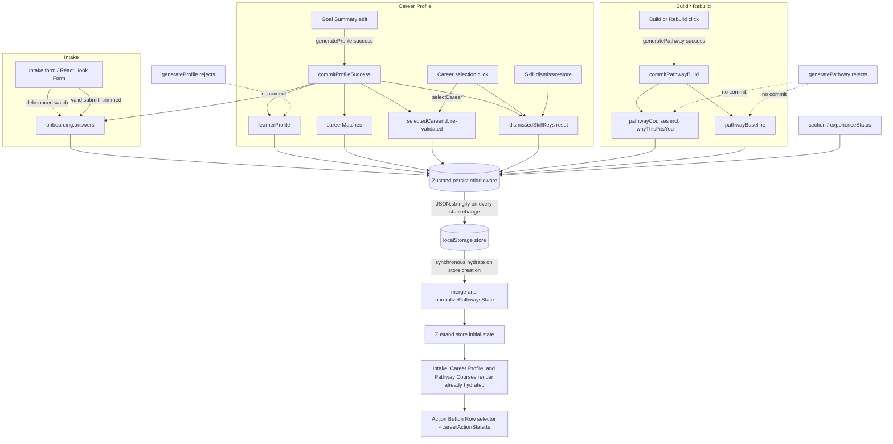

# Learner Pathways — Local Storage Persistence (ENT-12025)

## Scope note

This documents the persistence layer added on top of the **existing** Learner Pathways
scaffold. `generateProfileWorkflow` and `generatePathwayWorkflow` are still stubs — they
return deterministic, locally-computed results (the same static career-match and course
fixtures used elsewhere in the scaffold) rather than calling `fetchLearningIntent` /
`fetchRecommendationFeedback` (`src/components/app/data/services/xpert.ts`). Wiring those
real calls is explicitly deferred to a separate ticket, per the workflow files' own
"Integration seam" comments. What's documented here is: given whatever a successful
profile/pathway generation currently produces, how it becomes durable across a refresh.

## Architecture diagram



Failure paths (dashed above) never call `commitProfileSuccess` / `commitPathwayBuild`, so
the last successfully-committed (and therefore persisted) values are simply left in place.

## Persisted vs. transient

**Persisted** (`state/persistence.ts:partializePathwaysState`): `section`,
`experienceStatus`, `onboarding` (includes the live Intake draft), `learnerProfile`,
`careerMatches`, `selectedCareerId`, `pathwayCourses`, `pathwayBaseline`,
`dismissedSkillKeys`.

**Transient** (never persisted, always reset to defaults on load): `loading`, `errors`,
`progress` (re-derived from `pathwayCourses` at render time — see
`pathway-courses/utils.ts:derivePathwayProgress`), all component-local state (modal
open/close, Goal Summary edit mode, action-bar registration, refs).

`constructedPayloads` — a request-payload staging field from an earlier scaffold — was
removed in this change once nothing read it anymore (see audit below); it never needed a
persistence decision because it no longer exists.

## Mapping table

| Domain concept | Form/component source | API field(s) | Owning workflow/action | Zustand path | Local-storage path | Update trigger | Failure behavior |
|---|---|---|---|---|---|---|---|
| motivation | Intake `motivation` field | *(none yet — stub)* | debounced `setOnboardingAnswers`; trimmed on submit | `onboarding.answers.motivation` | `onboarding.answers.motivation` | every keystroke (debounced 300ms) + valid submit | draft preserved; last valid submit always wins over a stale pending debounce |
| goal | Intake `goal` field | *(none yet — stub)* | same as above; also mapped from `learnerProfile.careerGoal` on Goal Summary success | `onboarding.answers.goal` | `onboarding.answers.goal` | keystroke/submit; Goal Summary success | same as above |
| background | Intake `background` field | *(none yet — stub)* | same pattern; profile field name matches exactly | `onboarding.answers.background` | `onboarding.answers.background` | keystroke/submit; Goal Summary success | same as above |
| industry | Intake `industry` field | *(none yet — stub)* | same as above; mapped from `learnerProfile.targetIndustry` | `onboarding.answers.industry` | `onboarding.answers.industry` | keystroke/submit; Goal Summary success | same as above |
| transformed learner profile | Goal Summary edit form | *(none yet — stub result)* | `commitProfileSuccess` | `learnerProfile` | `learnerProfile` | successful `generateProfile()` | preserved verbatim on rejection |
| career matches | *(rendered, not a form)* | *(none yet — stub result)* | `commitProfileSuccess` (always replaces) | `careerMatches` | `careerMatches` | successful `generateProfile()` | preserved verbatim on rejection |
| selected career | Career match card click | — | `selectCareer`; re-validated by `commitProfileSuccess`/hydration via `normalizeSelectedCareerId` | `selectedCareerId` | `selectedCareerId` | click; profile success; hydration normalization | preserved unless it no longer references a current match |
| effective selected skill set | Skill chip dismiss/restore | — | `dismissSkill` / `restoreSkills` / `selectCareer` (atomic reset) | `dismissedSkillKeys` (exclusion set; effective list is a non-persisted derived selector) | `dismissedSkillKeys` | dismiss/restore click; career change | preserved; never falls back to profile skills merely because it's empty |
| pathway course (`courseKey`) | *(rendered, not a form)* | *(none yet — stub result)* | `commitPathwayBuild` | `pathwayCourses[].courseKey` | `pathwayCourses[].courseKey` | successful `generatePathway()` | prior complete course set preserved on rejection |
| per-course Recommendation Feedback | *(rendered, not a form)* | *(none yet — stub result, stands in for `reasons[courseKey]`)* | `commitPathwayBuild` | `pathwayCourses[].whyThisFitsYou` | `pathwayCourses[].whyThisFitsYou` | successful `generatePathway()` | preserved with its course; never orphaned since it's never a separate map |
| current section/status | Section navigation | — | `setSection` / `setExperienceStatus` / `commitPathwayBuild` (sets `pathway_ready`) | `section`, `experienceStatus` | `section`, `experienceStatus` | navigation; successful commits | hydration normalizes an inconsistent section back to one the persisted data can actually render |
| generated-pathway baseline | *(derived from profile + selected career at build time)* | — | seeded on mount if missing; set by `commitPathwayBuild` | `pathwayBaseline` | `pathwayBaseline` | successful build/rebuild; mount-time seed for a pathway with no baseline yet | preserved on rejection; cleared by hydration normalization if its `pathwayCourses` disappear |

## Intentional non-1:1 mappings

- **`dismissedSkillKeys` (exclusion set) instead of an "effective skills" inclusion list.**
  Persisting the inclusion list directly would make an empty result ambiguous between
  "nothing computed yet" and "learner dismissed everything" — exactly the bug the ticket
  warns against. The exclusion set has no such ambiguity and is self-correcting if the
  underlying career/profile skill list changes.
- **Recommendation Feedback lives on `PathwayCourse.whyThisFitsYou`, not a separate map.**
  `PathwayCourse` already carried `courseKey` + `whyThisFitsYou` for exactly this purpose
  before this ticket; a separate `Record<courseKey, reason>` would be a second copy of the
  same fact with its own staleness risk.
- **Intake answers vs. transformed profile are two fields, not one**, because they really are
  different lifecycle states: Intake answers are the learner's raw draft input; the profile
  is Learning-Intent-transformed output. A successful Goal Summary edit keeps them in sync
  (`mapProfileToOnboardingAnswers`), but a failed one intentionally does not touch the
  Intake side at all.
- **Current profile/career vs. `pathwayBaseline` are two fields, not one**, because the
  Action Button Row needs to compare "what's true now" against "what the saved pathway was
  actually built from" — collapsing them would make edit-detection impossible.

## Representative redacted storage JSON

```json
{
  "state": {
    "section": "pathway",
    "experienceStatus": "pathway_ready",
    "onboarding": {
      "answers": { "motivation": "...", "goal": "...", "background": "...", "industry": "..." },
      "currentQuestion": 0,
      "isComplete": true
    },
    "learnerProfile": {
      "summary": "...", "careerGoal": "...", "targetIndustry": "...", "background": "...",
      "motivation": "...", "learningStyle": "...", "weeklyTimeCommitment": "...",
      "certificatePreference": "...", "skills": ["..."]
    },
    "careerMatches": [{ "id": "career-1", "title": "...", "matchPercentage": 95 }],
    "selectedCareerId": "career-1",
    "dismissedSkillKeys": [],
    "pathwayCourses": [
      { "id": "course-1", "courseKey": "course-1", "title": "...", "status": "not_started", "whyThisFitsYou": "..." }
    ],
    "pathwayBaseline": {
      "careerGoal": "...", "targetIndustry": "...", "background": "...", "motivation": "...",
      "selectedCareerId": "career-1"
    }
  },
  "version": 1
}
```

No real learner data is shown above; every string is a placeholder.

## Hydration and normalization

Zustand's `persist` middleware hydrates synchronously against `localStorage` (a
synchronous storage engine) during store creation, before the store's initial state is
ever returned — so the very first render already reflects hydrated data; there is no
default-state flash to guard against.

`state/persistence.ts:mergePathwaysState` layers the persisted blob onto the store's own
freshly-initialized defaults (so a field added in a later release keeps its default when
absent from an older persisted blob) and then runs `state/normalize.ts:normalizePathwaysState`,
which corrects:
- `section: 'pathway'` with no persisted pathway → demoted to `'profile'`
- `section: 'profile'` with no usable profile or career matches → demoted further to
  `'onboarding'`
- a `selectedCareerId` that no longer references a current career match → falls back to
  the first match, or `null`
- a `pathwayBaseline` present with no `pathwayCourses` → cleared

A malformed (non-JSON) stored value is caught internally by zustand's own hydration
pipeline (`toThenable` wraps `storage.getItem`), which falls back to the initial state
without throwing — verified directly in
`state/pathwaysStorePersistence.test.ts`.

## Successful regeneration / failed workflow preservation

Both success paths are single atomic store actions, not a sequence of setters:
- `commitProfileSuccess({ learnerProfile, careerMatches })` — replaces the profile, syncs
  the corresponding Intake answers, always replaces career matches, re-validates the
  selected career, and resets dismissed skills.
- `commitPathwayBuild({ courses, baseline })` — replaces the complete course set (so a
  rebuild can never leave a stale course + fresh feedback, or vice versa) and updates the
  baseline together, and marks `experienceStatus: 'pathway_ready'`.

Both are only called from a workflow's resolved `.then()` path; a rejection is caught
before either commit runs, so the previous durable state is left completely untouched.

## Local-storage clearing

Clearing `localStorage` (or the whole site's storage) removes the persisted blob entirely.
On the next load, hydration finds nothing, and the store falls back to
`getInitialPathwaysState()` — the same code path already exercised by
`resetPathwaysState()` — so the app renders the Intake step from scratch without crashing.
No server-side recovery is attempted or expected.

## Account/storage scoping

The storage key (`edx.learner-pathways.state`) is **origin-scoped only, not user-scoped**.
No existing per-user storage-key convention was found anywhere in this app to reuse (this
is the first localStorage usage in the codebase), and building a new identity-scoping
framework was out of scope for this ticket. **Known limitation:** on a shared browser
profile, switching between enterprise-customer accounts in the same browser will surface
the previous account's persisted Learner Pathways state until that account's own activity
overwrites it. No TTL, cross-tab sync, or encryption was added, per the ticket's explicit
non-goals.

## Zustand/API/storage audit — what changed

- **Removed `constructedPayloads` entirely** (`PathwaysConstructedPayloads` type, the
  `constructedPayloads` state field, `setConstructedPayload`/`clearConstructedPayloads`
  actions, `usePathwaysConstructedPayloads` hook). It was a request-payload staging field
  from before workflows took explicit typed input; once both `generateProfile`/
  `generatePathway` were changed to accept explicit arguments instead of reading it, it
  became entirely dead (no remaining reads anywhere in the codebase — verified by repo-wide
  grep before removal).
- **Consolidated two independently-duplicated `selectedCareer` derivations**
  (`CareerSelectionContainer` and `CareerSelectionPage` each recomputed "which career is
  selected, falling back to the first match" against slightly different source arrays) into
  one shared `career-selection/selectors.ts:deriveSelectedCareer`, itself built on the same
  `normalizeSelectedCareerId` rule the hydration/persistence layer already uses — one
  canonical rule instead of three near-identical ones.
- **Moved `dismissedSkillKeys` out of component-local `useState`** in
  `CareerSelectionContainer` into the store, since it was the one piece of canonical Career
  Profile state that wasn't backed by the store at all.
- **`generateProfileWorkflow`/`generatePathwayWorkflow` now take explicit typed input and
  return typed results** instead of `Promise<void>` read from `constructedPayloads` — this
  was the literal "integration seam" gap called out in both files' own comments.
- **Retained (not removed) as intentional, distinct concepts:** `learnerProfile` vs.
  `pathwayBaseline` (current vs. generation-time snapshot); `onboarding.answers` vs.
  `learnerProfile` (raw draft vs. transformed output).
- **Deferred cleanup, not safe to do in this PR:** `getDisplayedPathwayCourses`'s
  render-time fixture fallback in `pathway-courses/utils.ts` still exists for the edge case
  of the Pathway section being reached with an empty store (e.g. a stale bookmark). It's
  never persisted, so it doesn't violate any invariant here, but removing it outright would
  be a product decision (what should render in that edge case?) outside this ticket's scope.
